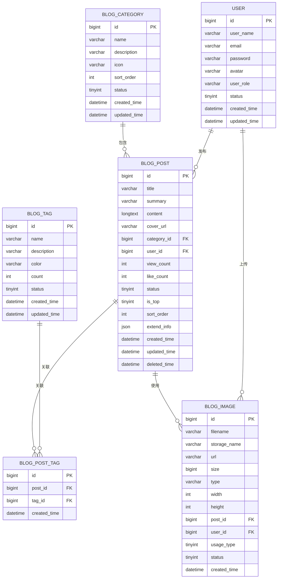

# 博客系统数据库设计文档

## 1. 需求分析

### 1.1 功能需求

根据前端博客页面的需求，系统需要支持以下核心功能：

| 功能模块 | 需求描述 | 对应前端页面 |
| :--- | :--- | :--- |
| 文章管理 | 创建、编辑、删除博客文章 | BlogCreatePage.vue |
| 文章展示 | 列表展示、详情展示、搜索、筛选 | BlogHomePage.vue、BlogPostPage.vue |
| 分类管理 | 文章分类创建、列表展示 | BlogCategoryPage.vue |
| 标签管理 | 文章标签创建、标签云展示 | BlogTagPage.vue |
| 图片上传 | 文章封面图片上传 | BlogCreatePage.vue |
| 用户关联 | 用户与文章的归属关系 | 全局 |

### 1.2 数据实体识别

基于需求分析，识别出以下核心数据实体：

| 实体 | 说明 |
| :--- | :--- |
| 博客文章 | 文章的核心信息（标题、摘要、内容、封面等） |
| 分类 | 文章的分类（如：前端开发、后端开发） |
| 标签 | 文章的标签（如：Vue、React） |
| 用户 | 系统用户（已有，需关联） |
| 文章标签关系 | 文章与标签的多对多关系 |
| 图片资源 | 上传的图片信息（封面、内容图片） |

---

## 2. 数据库设计原则

### 2.1 设计规范

1. **命名规范**
   - 数据库名：`example_db`（建议根据实际项目命名）
   - 表名：使用小写英文，下划线分隔，如 `blog_post`
   - 字段名：使用小写英文，下划线分隔，如 `created_time`
   - 主键：统一命名为 `id`，使用 BIGINT 类型

2. **数据类型选择原则**
   - 字符串：优先使用 VARCHAR，长度根据实际需求设定
   - 文本内容：使用 TEXT 或 LONGTEXT
   - 时间：统一使用 DATETIME 类型，存储 UTC 时间
   - 枚举值：使用 TINYINT 或 ENUM 类型

3. **索引设计原则**
   - 主键自动创建主键索引
   - 外键字段创建普通索引
   - 常用查询字段创建联合索引
   - 避免过度索引影响写入性能

4. **扩展性原则**
   - 预留扩展字段（如 `extend_info` JSON 字段）
   - 状态字段使用枚举，便于后续扩展
   - 使用软删除，便于数据恢复

---

## 3. 表结构设计

### 3.1 博客文章表（blog_post）

| 字段名 | 类型 | 约束 | 说明 |
| :--- | :--- | :--- | :--- |
| id | BIGINT | PRIMARY KEY, AUTO_INCREMENT | 文章ID |
| title | VARCHAR(200) | NOT NULL | 文章标题 |
| summary | VARCHAR(500) | NOT NULL | 文章摘要 |
| content | LONGTEXT | NOT NULL | 文章内容（支持 Markdown） |
| cover_url | VARCHAR(500) | NULL | 封面图片URL |
| category_id | BIGINT | NOT NULL, FOREIGN KEY | 分类ID |
| user_id | BIGINT | NOT NULL, FOREIGN KEY | 作者ID |
| view_count | INT | DEFAULT 0 | 浏览量 |
| like_count | INT | DEFAULT 0 | 点赞数 |
| status | TINYINT | DEFAULT 1 | 状态（0-草稿，1-发布，2-下架） |
| is_top | TINYINT | DEFAULT 0 | 是否置顶（0-否，1-是） |
| sort_order | INT | DEFAULT 0 | 排序顺序 |
| extend_info | JSON | NULL | 扩展信息（JSON格式，用于未来扩展） |
| created_time | DATETIME | NOT NULL | 创建时间 |
| updated_time | DATETIME | NOT NULL | 更新时间 |
| deleted_time | DATETIME | NULL | 删除时间（软删除） |

**索引设计：**

| 索引名 | 字段 | 类型 | 说明 |
| :--- | :--- | :--- | :--- |
| PRIMARY | id | 主键索引 | 主键 |
| idx_category_id | category_id | 普通索引 | 按分类查询 |
| idx_user_id | user_id | 普通索引 | 按作者查询 |
| idx_status | status | 普通索引 | 按状态筛选 |
| idx_is_top | is_top | 普通索引 | 置顶文章筛选 |
| idx_created_time | created_time | 普通索引 | 按时间排序 |
| idx_search | title, summary | 全文索引 | 搜索优化 |

### 3.2 分类表（blog_category）

| 字段名 | 类型 | 约束 | 说明 |
| :--- | :--- | :--- | :--- |
| id | BIGINT | PRIMARY KEY, AUTO_INCREMENT | 分类ID |
| name | VARCHAR(50) | NOT NULL, UNIQUE | 分类名称 |
| description | VARCHAR(200) | NULL | 分类描述 |
| icon | VARCHAR(100) | NULL | 分类图标（可选） |
| sort_order | INT | DEFAULT 0 | 排序顺序 |
| status | TINYINT | DEFAULT 1 | 状态（0-禁用，1-启用） |
| created_time | DATETIME | NOT NULL | 创建时间 |
| updated_time | DATETIME | NOT NULL | 更新时间 |

**索引设计：**

| 索引名 | 字段 | 类型 | 说明 |
| :--- | :--- | :--- | :--- |
| PRIMARY | id | 主键索引 | 主键 |
| uk_name | name | 唯一索引 | 分类名称唯一 |
| idx_status | status | 普通索引 | 按状态筛选 |

### 3.3 标签表（blog_tag）

| 字段名 | 类型 | 约束 | 说明 |
| :--- | :--- | :--- | :--- |
| id | BIGINT | PRIMARY KEY, AUTO_INCREMENT | 标签ID |
| name | VARCHAR(50) | NOT NULL, UNIQUE | 标签名称 |
| description | VARCHAR(200) | NULL | 标签描述 |
| color | VARCHAR(20) | DEFAULT '#667eea' | 标签颜色 |
| count | INT | DEFAULT 0 | 使用次数（缓存字段） |
| status | TINYINT | DEFAULT 1 | 状态（0-禁用，1-启用） |
| created_time | DATETIME | NOT NULL | 创建时间 |
| updated_time | DATETIME | NOT NULL | 更新时间 |

**索引设计：**

| 索引名 | 字段 | 类型 | 说明 |
| :--- | :--- | :--- | :--- |
| PRIMARY | id | 主键索引 | 主键 |
| uk_name | name | 唯一索引 | 标签名称唯一 |
| idx_status | status | 普通索引 | 按状态筛选 |

### 3.4 文章标签关系表（blog_post_tag）

| 字段名 | 类型 | 约束 | 说明 |
| :--- | :--- | :--- | :--- |
| id | BIGINT | PRIMARY KEY, AUTO_INCREMENT | 关系ID |
| post_id | BIGINT | NOT NULL, FOREIGN KEY | 文章ID |
| tag_id | BIGINT | NOT NULL, FOREIGN KEY | 标签ID |
| created_time | DATETIME | NOT NULL | 创建时间 |

**索引设计：**

| 索引名 | 字段 | 类型 | 说明 |
| :--- | :--- | :--- | :--- |
| PRIMARY | id | 主键索引 | 主键 |
| idx_post_id | post_id | 普通索引 | 按文章查询标签 |
| idx_tag_id | tag_id | 普通索引 | 按标签查询文章 |
| uk_post_tag | post_id, tag_id | 唯一索引 | 避免重复关联 |

### 3.5 图片资源表（blog_image）

| 字段名 | 类型 | 约束 | 说明 |
| :--- | :--- | :--- | :--- |
| id | BIGINT | PRIMARY KEY, AUTO_INCREMENT | 图片ID |
| filename | VARCHAR(200) | NOT NULL | 原始文件名 |
| storage_name | VARCHAR(200) | NOT NULL, UNIQUE | 存储文件名（UUID） |
| url | VARCHAR(500) | NOT NULL | 访问URL |
| size | BIGINT | NOT NULL | 文件大小（字节） |
| type | VARCHAR(50) | NOT NULL | MIME类型 |
| width | INT | NULL | 图片宽度（像素） |
| height | INT | NULL | 图片高度（像素） |
| post_id | BIGINT | NULL, FOREIGN KEY | 关联文章ID（可选） |
| user_id | BIGINT | NOT NULL, FOREIGN KEY | 上传用户ID |
| usage_type | TINYINT | DEFAULT 1 | 使用类型（1-封面，2-内容图片，3-其他） |
| status | TINYINT | DEFAULT 1 | 状态（0-删除，1-正常） |
| created_time | DATETIME | NOT NULL | 创建时间 |

**索引设计：**

| 索引名 | 字段 | 类型 | 说明 |
| :--- | :--- | :--- | :--- |
| PRIMARY | id | 主键索引 | 主键 |
| uk_storage_name | storage_name | 唯一索引 | 存储文件名唯一 |
| idx_post_id | post_id | 普通索引 | 按文章查询图片 |
| idx_user_id | user_id | 普通索引 | 按用户查询图片 |
| idx_usage_type | usage_type | 普通索引 | 按使用类型筛选 |

### 3.6 用户表（user）（已有表，需关联）

| 字段名 | 类型 | 约束 | 说明 |
| :--- | :--- | :--- | :--- |
| id | BIGINT | PRIMARY KEY, AUTO_INCREMENT | 用户ID |
| user_name | VARCHAR(50) | NOT NULL, UNIQUE | 用户名 |
| email | VARCHAR(100) | NOT NULL, UNIQUE | 邮箱 |
| password | VARCHAR(200) | NOT NULL | 密码（加密存储） |
| avatar | VARCHAR(500) | NULL | 头像URL |
| user_role | VARCHAR(20) | DEFAULT 'user' | 用户角色 |
| status | TINYINT | DEFAULT 1 | 状态 |
| created_time | DATETIME | NOT NULL | 创建时间 |
| updated_time | DATETIME | NOT NULL | 更新时间 |

---

## 4. 表关系图



---

## 5. DDL 语句

### 5.1 创建数据库

```sql
CREATE DATABASE IF NOT EXISTS example_db 
DEFAULT CHARACTER SET utf8mb4 
DEFAULT COLLATE utf8mb4_unicode_ci;

USE example_db;
```

### 5.2 创建分类表

```sql
CREATE TABLE IF NOT EXISTS blog_category (
    id BIGINT AUTO_INCREMENT PRIMARY KEY COMMENT '分类ID',
    name VARCHAR(50) NOT NULL COMMENT '分类名称',
    description VARCHAR(200) NULL COMMENT '分类描述',
    icon VARCHAR(100) NULL COMMENT '分类图标',
    sort_order INT DEFAULT 0 COMMENT '排序顺序',
    status TINYINT DEFAULT 1 COMMENT '状态（0-禁用，1-启用）',
    created_time DATETIME NOT NULL COMMENT '创建时间',
    updated_time DATETIME NOT NULL COMMENT '更新时间',
    UNIQUE KEY uk_name (name),
    KEY idx_status (status)
) ENGINE=InnoDB DEFAULT CHARSET=utf8mb4 COLLATE=utf8mb4_unicode_ci COMMENT='博客分类表';
```

### 5.3 创建标签表

```sql
CREATE TABLE IF NOT EXISTS blog_tag (
    id BIGINT AUTO_INCREMENT PRIMARY KEY COMMENT '标签ID',
    name VARCHAR(50) NOT NULL COMMENT '标签名称',
    description VARCHAR(200) NULL COMMENT '标签描述',
    color VARCHAR(20) DEFAULT '#667eea' COMMENT '标签颜色',
    count INT DEFAULT 0 COMMENT '使用次数',
    status TINYINT DEFAULT 1 COMMENT '状态（0-禁用，1-启用）',
    created_time DATETIME NOT NULL COMMENT '创建时间',
    updated_time DATETIME NOT NULL COMMENT '更新时间',
    UNIQUE KEY uk_name (name),
    KEY idx_status (status)
) ENGINE=InnoDB DEFAULT CHARSET=utf8mb4 COLLATE=utf8mb4_unicode_ci COMMENT='博客标签表';
```

### 5.4 创建文章表

```sql
CREATE TABLE IF NOT EXISTS blog_post (
    id BIGINT AUTO_INCREMENT PRIMARY KEY COMMENT '文章ID',
    title VARCHAR(200) NOT NULL COMMENT '文章标题',
    summary VARCHAR(500) NOT NULL COMMENT '文章摘要',
    content LONGTEXT NOT NULL COMMENT '文章内容',
    cover_url VARCHAR(500) NULL COMMENT '封面图片URL',
    category_id BIGINT NOT NULL COMMENT '分类ID',
    user_id BIGINT NOT NULL COMMENT '作者ID',
    view_count INT DEFAULT 0 COMMENT '浏览量',
    like_count INT DEFAULT 0 COMMENT '点赞数',
    status TINYINT DEFAULT 1 COMMENT '状态（0-草稿，1-发布，2-下架）',
    is_top TINYINT DEFAULT 0 COMMENT '是否置顶（0-否，1-是）',
    sort_order INT DEFAULT 0 COMMENT '排序顺序',
    extend_info JSON NULL COMMENT '扩展信息',
    created_time DATETIME NOT NULL COMMENT '创建时间',
    updated_time DATETIME NOT NULL COMMENT '更新时间',
    deleted_time DATETIME NULL COMMENT '删除时间',
    KEY idx_category_id (category_id),
    KEY idx_user_id (user_id),
    KEY idx_status (status),
    KEY idx_is_top (is_top),
    KEY idx_created_time (created_time),
    FULLTEXT KEY idx_search (title, summary),
    CONSTRAINT fk_post_category FOREIGN KEY (category_id) REFERENCES blog_category(id) ON DELETE CASCADE,
    CONSTRAINT fk_post_user FOREIGN KEY (user_id) REFERENCES user(id) ON DELETE CASCADE
) ENGINE=InnoDB DEFAULT CHARSET=utf8mb4 COLLATE=utf8mb4_unicode_ci COMMENT='博客文章表';
```

### 5.5 创建文章标签关系表

```sql
CREATE TABLE IF NOT EXISTS blog_post_tag (
    id BIGINT AUTO_INCREMENT PRIMARY KEY COMMENT '关系ID',
    post_id BIGINT NOT NULL COMMENT '文章ID',
    tag_id BIGINT NOT NULL COMMENT '标签ID',
    created_time DATETIME NOT NULL COMMENT '创建时间',
    KEY idx_post_id (post_id),
    KEY idx_tag_id (tag_id),
    UNIQUE KEY uk_post_tag (post_id, tag_id),
    CONSTRAINT fk_post_tag_post FOREIGN KEY (post_id) REFERENCES blog_post(id) ON DELETE CASCADE,
    CONSTRAINT fk_post_tag_tag FOREIGN KEY (tag_id) REFERENCES blog_tag(id) ON DELETE CASCADE
) ENGINE=InnoDB DEFAULT CHARSET=utf8mb4 COLLATE=utf8mb4_unicode_ci COMMENT='文章标签关系表';
```

### 5.6 创建图片资源表

```sql
CREATE TABLE IF NOT EXISTS blog_image (
    id BIGINT AUTO_INCREMENT PRIMARY KEY COMMENT '图片ID',
    filename VARCHAR(200) NOT NULL COMMENT '原始文件名',
    storage_name VARCHAR(200) NOT NULL COMMENT '存储文件名',
    url VARCHAR(500) NOT NULL COMMENT '访问URL',
    size BIGINT NOT NULL COMMENT '文件大小',
    type VARCHAR(50) NOT NULL COMMENT 'MIME类型',
    width INT NULL COMMENT '图片宽度',
    height INT NULL COMMENT '图片高度',
    post_id BIGINT NULL COMMENT '关联文章ID',
    user_id BIGINT NOT NULL COMMENT '上传用户ID',
    usage_type TINYINT DEFAULT 1 COMMENT '使用类型（1-封面，2-内容图片，3-其他）',
    status TINYINT DEFAULT 1 COMMENT '状态（0-删除，1-正常）',
    created_time DATETIME NOT NULL COMMENT '创建时间',
    UNIQUE KEY uk_storage_name (storage_name),
    KEY idx_post_id (post_id),
    KEY idx_user_id (user_id),
    KEY idx_usage_type (usage_type),
    CONSTRAINT fk_image_post FOREIGN KEY (post_id) REFERENCES blog_post(id) ON DELETE SET NULL,
    CONSTRAINT fk_image_user FOREIGN KEY (user_id) REFERENCES user(id) ON DELETE CASCADE
) ENGINE=InnoDB DEFAULT CHARSET=utf8mb4 COLLATE=utf8mb4_unicode_ci COMMENT='图片资源表';
```

---

## 6. 扩展性设计

### 6.1 预留扩展字段

| 表名 | 扩展字段 | 用途 |
| :--- | :--- | :--- |
| blog_post | extend_info | 存储未来新增的非核心字段，如 SEO 信息、阅读时间预估等 |
| blog_category | icon, description | 预留图标和描述字段 |
| blog_tag | color, description | 预留颜色和描述字段 |

### 6.2 状态字段扩展

当前设计中使用 TINYINT 类型存储状态，预留了足够的扩展空间：

| 字段 | 当前值 | 预留扩展 |
| :--- | :--- | :--- |
| blog_post.status | 0-草稿, 1-发布, 2-下架 | 3-审核中, 4-已归档等 |
| blog_post.is_top | 0-否, 1-是 | 可扩展为优先级等级 |
| blog_image.usage_type | 1-封面, 2-内容图片, 3-其他 | 4-头像, 5-广告图等 |

### 6.3 索引扩展建议

根据未来业务需求，可考虑添加以下索引：

| 表名 | 建议索引 | 适用场景 |
| :--- | :--- | :--- |
| blog_post | idx_status_created_time (status, created_time) | 按状态和时间查询 |
| blog_post | idx_user_id_status (user_id, status) | 按用户和状态查询 |
| blog_post_tag | idx_tag_id_post_id (tag_id, post_id) | 按标签查询文章时排序 |

### 6.4 未来可能扩展的表

| 表名 | 用途 | 说明 |
| :--- | :--- | :--- |
| blog_comment | 评论表 | 文章评论功能 |
| blog_like | 点赞记录表 | 记录用户点赞行为 |
| blog_series | 文章系列表 | 将多篇文章组织成系列 |
| blog_statistics | 统计数据表 | 文章阅读统计、用户行为分析 |

---

## 7. 数据字典

### 7.1 状态码定义

| 字段 | 值 | 含义 |
| :--- | :--- | :--- |
| blog_post.status | 0 | 草稿 |
| blog_post.status | 1 | 发布 |
| blog_post.status | 2 | 下架 |
| blog_post.is_top | 0 | 不置顶 |
| blog_post.is_top | 1 | 置顶 |
| blog_category.status | 0 | 禁用 |
| blog_category.status | 1 | 启用 |
| blog_tag.status | 0 | 禁用 |
| blog_tag.status | 1 | 启用 |
| blog_image.usage_type | 1 | 封面图片 |
| blog_image.usage_type | 2 | 内容图片 |
| blog_image.usage_type | 3 | 其他 |
| blog_image.status | 0 | 删除 |
| blog_image.status | 1 | 正常 |

### 7.2 命名规范总结

| 类型 | 示例 | 说明 |
| :--- | :--- | :--- |
| 数据库 | example_db | 小写，下划线分隔 |
| 表 | blog_post | 小写，下划线分隔，前缀标识模块 |
| 字段 | created_time | 小写，下划线分隔 |
| 主键 | id | 统一命名为 id |
| 外键 | category_id | 关联表名 + _id |
| 索引 | idx_category_id | idx_前缀 + 字段名 |
| 唯一约束 | uk_name | uk_前缀 + 字段名 |

---

## 8. 总结

本数据库设计满足当前博客系统的所有需求，并通过以下设计保证未来可扩展性：

1. **预留扩展字段**：通过 `extend_info` JSON 字段存储非核心数据
2. **状态字段设计**：使用 TINYINT 类型，预留足够扩展空间
3. **软删除支持**：通过 `deleted_time` 字段实现软删除
4. **索引优化**：根据查询需求合理设计索引，预留扩展空间
5. **表结构规范化**：遵循第三范式，减少数据冗余
6. **关系清晰**：通过外键约束保证数据完整性

未来扩展时，只需添加新字段或新表，无需大规模修改现有结构，确保系统的稳定性和可维护性。