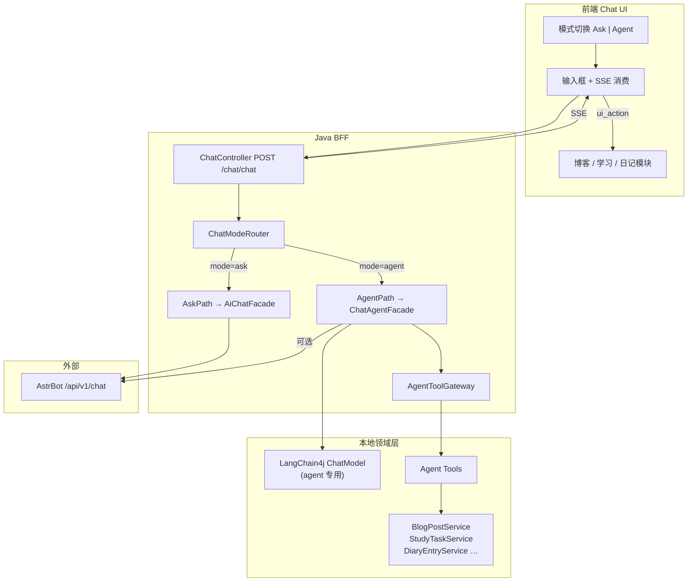
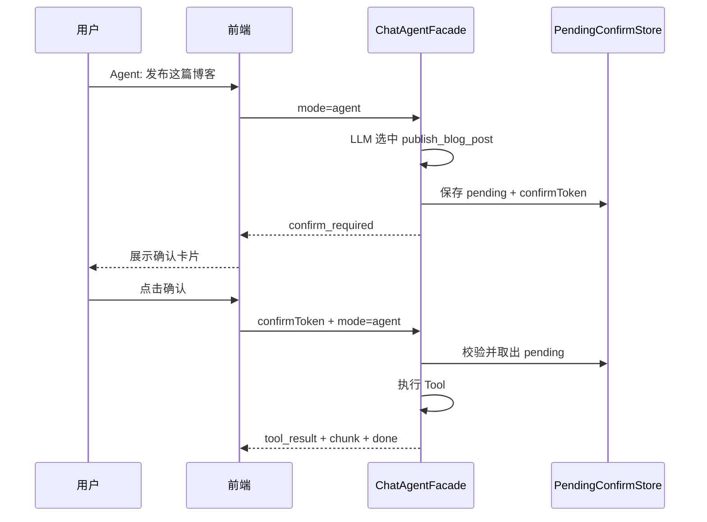

# 聊天 Ask / Agent 双模式 — 架构设计文档

> **状态**：已实现（后端 P1+P2；L2 确认与审计表为二期）  
> **前端指南**：[chat-agent-frontend-guide.md](./chat-agent-frontend-guide.md)  
> **产品定位**：在现有 AstrBot 角色聊天之上，增加与 Cursor / ChatGPT 类似的 **Ask（只读对话）** 与 **Agent（可执行本站业务）** 模式切换。

---

## 1. 文档说明

### 1.1 目标

- 用户可在聊天界面 **显式切换 Ask / Agent 模式**（市面常见交互）。
- **Ask 模式**：沿用现有 AstrBot BFF，只生成文本，**不调用业务写接口**。
- **Agent 模式**：Java 后端本地 Agent Loop + Tool 层，以 **当前登录用户身份** 操作博客、学习工作台、日记等模块。
- 统一 **SSE 流式协议**，扩展 `tool_call` / `tool_result` / `ui_action` 等事件，前端可展示「正在创建待办…」并刷新页面模块。
- **智能分段（`segment_plan`）仅 Ask 模式启用**；Agent 模式流结束后直接 `done`，不做气泡拆分。
- 与代码生成（`/app/chat/gen/code` + LangChain4j）**彻底分离**，互不影响。

### 1.2 非目标（本期不做）

- 浏览器 DOM 自动化 / RPA（Computer Use）。
- 让 AstrBot 直接携带 Session Cookie 调用本站 REST。
- Agent 模式下替换 AstrBot 人格（仍可选 configId 决定语气；执行层与对话层分离）。
- 普通 `user` 角色开放 Study 写接口（当前 Study 模块仍为 `administrator`，见 [study_module_design.md](./study_module_design.md) §1.2）。

### 1.3 设计原则对齐

| 原则 | 本设计中的体现 |
| :--- | :--- |
| 单一职责 | AstrBot = 对话与人格；Java Tool = 本站业务副作用 |
| 关注点分离 | 认知编排（LLM loop）与领域服务（BlogPostService 等）分层 |
| 最小权限 | Tool 白名单 + L0/L1/L2 分级；L2 需用户确认 |
| 开闭原则 | 新增业务能力 = 注册新 Tool，不改 SSE 主契约 |
| 市面一致性 | Ask/Agent 模式切换 + tool_call 可观测流 |

---

## 2. 市面模式对照

| 维度 | Ask 模式 | Agent 模式 |
| :--- | :--- | :--- |
| 典型产品 | ChatGPT Chat、Cursor Ask | Cursor Agent、ChatGPT Agent / Actions |
| 副作用 | 无（不落库、不改业务数据） | 有（创建待办、写博客草稿等） |
| 工具 | 无或仅 AstrBot 内置只读能力 | Java Tool Registry（本站 API 语义） |
| 延迟 | 低 | 较高（多轮 Plan-Act-Observe） |
| 风险 | 低 | 需确认流、审计、超时控制 |
| 默认 | **推荐默认 Ask**，降低误操作 | 用户主动切换或发送前选择 |

---

## 3. 总体架构



### 3.1 路径说明

| 路径 | 触发条件 | 后端行为 |
| :--- | :--- | :--- |
| **Ask** | `mode = "ask"`（默认） | 现有 `AiChatFacade` → `AstrBotChatService.streamChat`，行为与线上一致 |
| **Agent** | `mode = "agent"` | `ChatAgentFacade` → LangChain4j Tool Loop → `AgentToolGateway` → 各 Service |

> **混合语气（可选 Phase 2）**：Agent 模式下，Tool 执行完成后可将摘要 + 用户原话转发 AstrBot 做「角色化润色」。MVP 阶段 Agent 直接用本地 LLM 组织回复即可。

---

## 4. 模式切换设计

### 4.1 前端 UX（推荐）

```
┌─────────────────────────────────────────┐
│  [Ask ▼]  角色: 达妮娅                    │  ← Segmented Control 或 Toggle
├─────────────────────────────────────────┤
│  … 消息列表（含 tool_call 卡片）…          │
├─────────────────────────────────────────┤
│  Agent 模式：可帮你创建待办、博客草稿等      │  ← 模式提示条（Agent 时显示）
│  [输入消息…]                    [发送]    │
└─────────────────────────────────────────┘
```

| 元素 | 说明 |
| :--- | :--- |
| 模式控件 | `Ask` / `Agent` 二选一；切换不清空会话，但 **下一条消息** 起生效 |
| 默认模式 | `Ask` |
| Agent 提示 | 首次进入 Agent 或切换时 Toast：「Agent 可修改你的博客与待办，请确认指令清晰」 |
| 确认卡片 | L2 工具触发时，在聊天流内插入 **ConfirmCard**（见 §8.3） |

### 4.2 请求字段扩展

在现有 `ChatRequest` 上增加：

```java
/**
 * 聊天模式：ask（默认）| agent
 */
private String mode;

/**
 * 可选。Agent 模式下，L2 工具用户确认后继续执行时传入。
 */
private String confirmToken;
```

**示例 — Ask 模式（与现网兼容）**

```json
{
  "conversationId": 1001,
  "message": "今天天气怎么样？",
  "mode": "ask"
}
```

**示例 — Agent 模式**

```json
{
  "conversationId": 1001,
  "message": "帮我在今日待办里加一条：写博客大纲",
  "mode": "agent"
}
```

**示例 — 确认后继续**

```json
{
  "conversationId": 1001,
  "message": "确认发布",
  "mode": "agent",
  "confirmToken": "cfm_8f3a2b1c..."
}
```

> `mode` 省略时后端视为 `"ask"`，**向后兼容**现有前端。

### 4.3 配置接口扩展（可选）

`GET /api/chat/configs` 的 `ChatConfigVO.raw` 已透传 AstrBot 字段；可增加后端静态配置：

```json
{
  "defaultMode": "ask",
  "agentEnabled": true,
  "agentHint": "Agent 模式可创建待办、博客草稿等，不会删除数据除非您确认"
}
```

建议新增 `GET /api/chat/agent/config` 返回上述信息及 Tool 能力摘要（供设置页展示）。

---

## 5. Agent 执行模型

### 5.1 Agent Loop（LangChain4j）

与代码生成共用 **基础设施**（OpenAI 兼容 API），但使用 **独立 model 配置**（可与智能分段、代码生成分离）：

```yaml
# application.yml（规划）
langchain4j:
  open-ai:
    agent-chat-model:
      base-url: https://dashscope.aliyuncs.com/compatible-mode/v1
      api-key: ${DASHSCOPE_API_KEY}
      model-name: qwen-plus          # 需支持 function calling
      max-tokens: 4096
      temperature: 0.3
      timeout: 60s

chat:
  agent:
    enabled: true
    max-steps: 8                   # 单轮最多 tool 调用次数
    read-timeout-ms: 120000
    require-confirm-level: L2      # L2 工具必须 confirmToken
    astrbot-polish: false          # Phase 2：是否用 AstrBot 润色最终回复
```

**Loop 伪代码**

```
1. 解析 loginUser、conversationId、mode
2. 若 mode != agent → 走 AskPath（现有逻辑）
3. 若 confirmToken 有效 → 执行挂起的 L2 操作，跳过 LLM
4. 否则：
   a. 持久化 user message（与现网一致）
   b. 构建 Agent（system prompt + tools + 最近 N 条历史）
   c. while step < maxSteps:
        - LLM 返回 text → 结束，流式输出 chunk
        - LLM 返回 toolCalls → 执行 ToolGateway
        - 推送 SSE tool_call / tool_result
        - L2 且无 confirmToken → 推送 confirm_required，暂停
   d. 持久化 assistant message + tool 摘要 metadata
   e. 推送 done（**不触发 segment_plan**，见 §7.1）
```

### 5.2 System Prompt 要点（Agent）

```
你是本站智能助手，可以通过工具帮用户管理博客、学习待办、日记。
规则：
- 只使用提供的工具，不要编造已执行的操作。
- 缺少 listId、categoryId 等必填信息时，先调用 list_* 工具查询。
- 创建类操作优先草稿/今日待办，不要默认发布或删除。
- 用户用 Ask 语气仅咨询时，直接回答，不必调用工具。
- 回复简洁，并在执行成功后说明结果（含 id 若适用）。
```

---

## 6. Tool 层设计

### 6.1 分层结构

```
com.ai.agent
├── ChatAgentFacade.java          # Agent 入口，SSE 编排
├── ChatModeRouter.java           # ask / agent 分流
├── AgentToolGateway.java         # 统一执行、鉴权、审计、分级
├── AgentToolRegistry.java        # 注册表
├── AgentTool.java                # 接口：name, description, schema, level, execute
├── AgentToolContext.java         # userId, conversationId, request
├── AgentToolResult.java          # success, data, error, uiAction
├── confirm/
│   ├── PendingConfirmStore.java  # confirmToken 短期存储（Redis 或内存）
│   └── ConfirmRequiredException.java
└── tools/
    ├── study/StudyTaskTools.java
    ├── blog/BlogPostTools.java
    └── diary/DiaryEntryTools.java
```

**核心约束**

- Tool **只调用现有 Service**，禁止 HTTP 调自己的 Controller，禁止直连 Mapper。
- Tool 入参由 LangChain4j `@Tool` 或 JSON Schema 描述；出参为 **结构化 JSON 字符串** 供 LLM 继续推理。
- 所有 Tool 经 `AgentToolGateway.execute(name, args, ctx)`，统一记录审计日志。

### 6.2 副作用分级

| 级别 | 含义 | Agent 行为 | 示例 |
| :--- | :--- | :--- | :--- |
| **L0** | 只读 | 直接执行 | `list_study_lists`、`list_today_tasks`、`list_blog_categories` |
| **L1** | 可逆写 | 直接执行 | `create_study_task`、`create_blog_draft`、`save_diary_entry` |
| **L2** | 高风险 | **必须用户确认** | `publish_blog_post`、`delete_study_task`、`delete_diary_entry` |

MVP 建议 **仅实现 L0 + L1**；L2 在 Registry 中预留，默认 `enabled: false`。

### 6.3 Tool 目录（MVP）

#### Study（学习工作台）

| Tool 名 | 级别 | 说明 | 映射 Service |
| :--- | :---: | :--- | :--- |
| `list_study_lists` | L0 | 列出用户清单 | `StudyListService` |
| `list_today_tasks` | L0 | 今日待办视图 | `StudyTaskService` / 视图查询 |
| `create_study_task` | L1 | 创建任务；支持 `isToday` | `StudyTaskService.addTask` |
| `toggle_study_task` | L1 | 完成/取消完成 | `StudyTaskService.toggleTask` |
| `delete_study_task` | L2 | 删除任务 | 二期 + 确认 |

**`create_study_task` 参数示例**

```json
{
  "title": "写博客大纲",
  "isToday": true,
  "listId": null,
  "content": null,
  "dueDate": "2026-06-16",
  "priority": 2
}
```

`listId` 为空时 Gateway 内解析默认清单（如「收集箱」或第一个 list）。

#### Blog（博客）

| Tool 名 | 级别 | 说明 | 映射 Service |
| :--- | :---: | :--- | :--- |
| `list_blog_categories` | L0 | 分类列表 | `BlogCategoryService` |
| `list_blog_tags` | L0 | 标签列表 | `BlogTagService` |
| `create_blog_draft` | L1 | 创建草稿 `status=0` | `BlogPostService.addBlogPost` |
| `update_blog_draft` | L1 | 更新草稿 | `BlogPostService.updateBlogPost` |
| `publish_blog_post` | L2 | 发布 | 二期 + 确认 |

#### Diary（日记）

| Tool 名 | 级别 | 说明 | 映射 Service |
| :--- | :---: | :--- | :--- |
| `get_diary_by_date` | L0 | 按日期查询 | `DiaryEntryService` |
| `save_diary_entry` | L1 | 创建/更新当日日记 | `DiaryEntryService.save` |

### 6.4 uiAction 约定（前端刷新）

Tool 成功后可在 `tool_result` 中携带 `uiAction`，驱动模块刷新而无需用户手动 F5：

```json
{
  "event": "tool_result",
  "tool": "create_study_task",
  "success": true,
  "data": { "taskId": 1001, "title": "写博客大纲" },
  "uiAction": {
    "type": "refresh",
    "module": "study_today"
  }
}
```

| module 值 | 前端行为 |
| :--- | :--- |
| `study_today` | 刷新今日待办列表 |
| `study_task_list` | 刷新任务视图 |
| `blog_list` | 刷新博客列表 |
| `blog_editor` | 跳转 `/blog/edit/{id}` 或打开编辑抽屉 |
| `diary_day` | 刷新当前日记页 |

| type 值 | 说明 |
| :--- | :--- |
| `refresh` | 触发对应 module 数据重新拉取 |
| `navigate` | 跳转 `path` 字段 |
| `toast` | 显示 `message` |

---

## 7. SSE 事件协议

在现有 `chunk` / `segment_plan` / `done` 基础上扩展（**Ask 模式行为不变**）。

> **Agent 模式不做回复分段**：`ChatSegmentationService` / `segment_plan` **仅 Ask 路径启用**。Agent 回复偏任务总结，且已有 `tool_call` / `tool_result` 卡片，无需再拆气泡。

### 7.1 事件一览

| event | 方向 | 说明 | Ask | Agent |
| :--- | :---: | :--- | :---: | :---: |
| `chunk` | S→C | 流式文本 | ✓ | ✓ |
| `tool_call` | S→C | 即将/正在调用工具 | | ✓ |
| `tool_result` | S→C | 工具执行结果 + 可选 uiAction | | ✓ |
| `confirm_required` | S→C | L2 待确认 | | ✓（二期） |
| `segment_plan` | S→C | 智能分段（Ask 专用） | ✓ | ✗ |
| `done` | S→C | 本轮结束 | ✓ | ✓ |
| `error` | S→C | 可恢复错误摘要 | ✓ | ✓ |

### 7.2 载荷格式

**tool_call**

```json
{
  "event": "tool_call",
  "tool": "create_study_task",
  "args": { "title": "写博客大纲", "isToday": true },
  "step": 1,
  "type": "agent"
}
```

**tool_result**

```json
{
  "event": "tool_result",
  "tool": "create_study_task",
  "success": true,
  "data": { "taskId": 1001 },
  "uiAction": { "type": "refresh", "module": "study_today" },
  "step": 1,
  "type": "agent"
}
```

**confirm_required（二期）**

```json
{
  "event": "confirm_required",
  "confirmToken": "cfm_8f3a2b1c",
  "tool": "publish_blog_post",
  "summary": "将发布文章《Spring 入门》到分类「技术」",
  "expiresInSec": 300,
  "type": "agent"
}
```

**error**

```json
{
  "event": "error",
  "message": "创建失败：未找到默认清单",
  "type": "agent"
}
```

### 7.3 向后兼容

- 无 `event` 字段时仍按 `chunk` 处理（与 [chat-astrbot-frontend-guide.md](./chat-astrbot-frontend-guide.md) 一致）。
- `type` 字段：Ask 模式为 `configId`；Agent 模式固定 `"agent"` 或 `"agent:{configId}"`。

### 7.4 前端消费顺序（Agent 一轮）

```
tool_call → tool_result → … → chunk（最终自然语言）→ done
```

（无 `segment_plan`）

UI 建议在消息流中插入 **Tool 卡片**（折叠展示 args/result），最终 AI 气泡仍由 `chunk` 累积。

---

## 8. 安全与审计

### 8.1 身份与权限

| 项 | 规则 |
| :--- | :--- |
| 鉴权 | 与现网相同：Session Cookie，`UserService.getLoginUser` |
| Study 写操作 | 遵循现有 `@AuthCheck(administrator)`；Agent 不绕过 |
| 数据隔离 | Tool 内所有 Service 调用带 `loginUser.getId()` |
| AstrBot | Ask 模式不暴露 API Key；Agent 写操作 **不经过** AstrBot |

### 8.2 审计日志（建议表 `chat_agent_audit`）

| 字段 | 说明 |
| :--- | :--- |
| id | 主键 |
| user_id | 用户 |
| conversation_id | 会话 |
| tool_name | 工具名 |
| tool_args | JSON |
| success | 是否成功 |
| result_summary | 结果摘要 |
| create_time | 时间 |

用于排查「AI 误创建」类问题；**不存完整博客正文**时可截断。

### 8.3 L2 确认流（二期）



`confirmToken` TTL 建议 5 分钟，一次性消费。

---

## 9. AstrBot 与 Agent 边界

| 能力 | Ask（AstrBot） | Agent（Java Tools） |
| :--- | :--- | :--- |
| 角色语气 / 插件 / MCP 通用工具 | ✓ 主路径 | 可选润色（Phase 2） |
| 创建本站博客/待办/日记 | ✗ | ✓ 唯一写路径 |
| 思维链展示 | 后端 `cleanDisplayContent` 过滤 | Tool 卡片展示执行过程 |
| Session | `astrbotSessionId`  per conversation | 同一 conversationId 共享历史 |

**避免双 Agent**：不要让 AstrBot 插件与本 Java Tool 注册 **同名同类** 写操作；若 AstrBot 侧有 MCP，仅保留 **只读或外部系统** 工具。

---

## 10. 与现有模块关系

```
┌──────────────────────────────────────────────────────────┐
│ 代码生成 App（不变）                                       │
│  GET /app/chat/gen/code → LangChain4j codegen prompt      │
└──────────────────────────────────────────────────────────┘

┌──────────────────────────────────────────────────────────┐
│ 角色聊天 Ask（已实现）                                     │
│  POST /chat/chat mode=ask → AstrBot                      │
└──────────────────────────────────────────────────────────┘

┌──────────────────────────────────────────────────────────┐
│ 角色聊天 Agent（本设计）                                   │
│  POST /chat/chat mode=agent → ChatAgentFacade → Tools     │
└──────────────────────────────────────────────────────────┘

┌──────────────────────────────────────────────────────────┐
│ 智能分段（已实现，Ask 专用）                               │
│  仅 mode=ask 流结束后触发 segment_plan；Agent 跳过         │
└──────────────────────────────────────────────────────────┘
```

---

## 11. 实施分期

| 阶段 | 范围 | 交付物 |
| :--- | :--- | :--- |
| **P0 设计评审** | 本文档 | 前后端对齐协议 |
| **P1 MVP** | mode 字段 + Router；Agent Facade；Study L0/L1 Tool；SSE tool_* 事件 | 可「创建今日待办」 |
| **P2** | Blog + Diary L0/L1；uiAction；前端 Tool 卡片 + 模式切换 UI | 可「写博客草稿」并刷新页 |
| **P3** | L2 确认流；审计表；Agent 专用配置与健康检查 | 可安全发布/删除 |
| **P4** | AstrBot 润色；自动模式建议（可选） | 体验 polish |

### P1 任务清单（开发参考）

**后端**

- [ ] `ChatRequest.mode` / `confirmToken`
- [ ] `ChatModeRouter`、`ChatAgentFacade`（Agent 路径 **不调用** `ChatSegmentationService` / `buildTailEvents`）
- [ ] `AgentToolGateway` + `StudyTaskTools`（3～4 个 Tool）
- [ ] `ChatStreamEvent` 扩展 + `ChatController` 序列化
- [ ] `application.yml` → `chat.agent.*`
- [ ] 单元测试：Tool Gateway _mock Service_

**前端**

- [ ] Ask/Agent 切换控件，默认 Ask
- [ ] POST body 带 `mode`
- [ ] 解析 `tool_call` / `tool_result` / `uiAction`
- [ ] Agent 模式提示文案

---

## 12. 接口变更摘要

| 方法 | 路径 | 变更 |
| :--- | :--- | :--- |
| POST | `/api/chat/chat` | 请求体增加 `mode`、`confirmToken`；响应 SSE 增加 Agent 事件 |
| GET | `/api/chat/agent/config` | **新增**（可选）Agent 能力与提示文案 |
| GET | `/api/chat/configs` | 无破坏性变更 |
| 其余 | `/chat/conversations/*` | 无变更 |

---

## 13. 错误与超时

| 场景 | 行为 |
| :--- | :--- |
| Agent 未启用 | `400` + 「Agent 模式暂未开放」 |
| Tool 执行失败 | SSE `tool_result.success=false` + LLM 组织失败说明 + 仍 `done` |
| 超过 maxSteps | SSE `error` + 「步骤过多，请拆分指令」 |
| LLM 超时 | 与 AstrBot 类似，落库 error 消息 |
| Study 无 administrator 权限 | Tool 返回权限错误，不抛 500 |

---

## 14. 测试用例（验收）

| # | 模式 | 输入 | 期望 |
| :---: | :--- | :--- | :--- |
| 1 | Ask | 「你好」 | 仅 chunk + done，无 tool_* |
| 2 | Agent | 「列出我的清单」 | tool_call list_study_lists → tool_result → 文本总结 |
| 3 | Agent | 「今日待办加一条：复习 Redis」 | create_study_task isToday=true → uiAction refresh study_today |
| 4 | Agent | 「帮我写一篇标题为 XX 的博客草稿」 | create_blog_draft → 返回 postId |
| 5 | Ask | 省略 mode | 与现网一致 |
| 6 | Agent | 无权限用户调 Study Tool | tool_result 失败，提示无权限 |

---

## 15. 参考

- AstrBot OpenAPI：https://docs.astrbot.app/dev/openapi.html
- 现有实现：`AiChatFacade`、`AstrBotChatServiceImpl`、`ChatStreamEvent`
- LangChain4j Tools：https://docs.langchain4j.dev/tutorials/tools
- 类似 BFF 模式：`TtsProxyServiceImpl`、`frontend-tts-api.md`

---

## 16. 修订记录

| 版本 | 日期 | 说明 |
| :--- | :--- | :--- |
| v0.1 | 2026-06-16 | 初稿：Ask/Agent 双模式、Tool 分层、SSE 协议、实施分期 |
| v0.2 | 2026-06-16 | Agent 模式明确不启用 segment_plan / 智能分段 |
| v1.0 | 2026-06-16 | 后端实现：Ask/Agent 路由、Tool 模块 study/blog/diary、SSE 扩展 |
