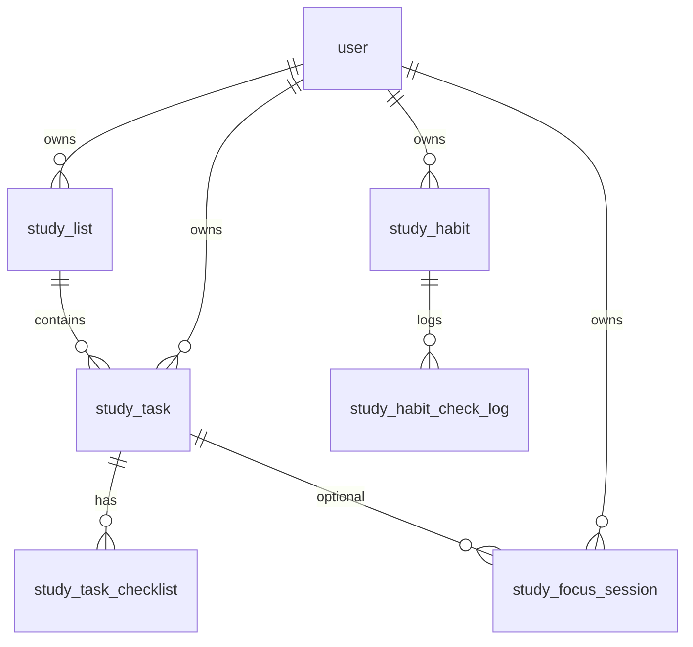

# 学习工作台（Study）后端设计文档

> 对应前端页面：`/administrator/study`（`StudyView.vue`）  
> 技术栈：Spring Boot + MySQL + Redis  
> 产品定位：类 TickTick 的私人学习工作台（任务、清单、番茄专注、习惯打卡、今日统计）

---

## 1. 文档说明

### 1.1 目标

为学习页提供**完整后端能力**，包括：

- 数据库表结构与 DDL
- REST API 清单（路径、入参、出参、权限）
- Redis 缓存与实时状态设计
- 业务规则与错误码约定

本文档供 Spring Boot 后端实现与前端 OpenAPI 代码生成对齐使用，风格与现有博客模块（`doc/blog_database_design.md`）保持一致。

### 1.2 权限模型

| 项目 | 说明 |
| :--- | :--- |
| 访问角色 | 仅 `administrator` 角色可调用本模块全部接口 |
| 鉴权方式 | Session Cookie（与全站一致，`withCredentials: true`） |
| 数据隔离 | 所有业务表带 `user_id`，仅允许操作当前登录用户自己的数据 |
| 未登录 | 返回 `code = 40100` |
| 无权限 | 返回 `code = 40101`（非 administrator） |

> 若未来开放给普通登录用户，可将权限从 Controller 注解层下调为 `user`，数据仍按 `user_id` 隔离。

### 1.3 实现分期

| 阶段 | 范围 | 表 / 接口 |
| :--- | :--- | :--- |
| **P1 MVP** | 清单 + 任务 + 智能视图 + 今日统计 | `study_list`、`study_task` |
| **P2** | 子任务检查项 + 任务排序批量更新 | `study_task_checklist` |
| **P3** | 番茄专注 | `study_focus_session` |
| **P4** | 习惯打卡 | `study_habit`、`study_habit_check_log` |
| **P5** | 与博客联动（可选） | 任务 `source_type` 扩展 |

---

## 2. 通用约定

### 2.1 响应结构

与现有项目一致：

```json
{
  "code": 0,
  "data": {},
  "message": "ok"
}
```

| code | 含义 |
| :--- | :--- |
| 0 | 成功 |
| 40000 | 请求参数错误 |
| 40100 | 未登录 |
| 40101 | 无权限 |
| 40300 | 禁止访问（非本人数据） |
| 40400 | 资源不存在 |
| 50000 | 系统内部异常 |
| 50001 | 操作失败（业务校验未通过） |

### 2.2 命名规范

| 层级 | 规范 | 示例 |
| :--- | :--- | :--- |
| 表名 | 小写 + 下划线 | `study_task` |
| 字段名 | 小写 + 下划线 | `due_date` |
| API 路径 | `/study/{资源}/{动作}` | `/study/task/add` |
| Java 实体 | 驼峰 | `StudyTask` |
| JSON 字段 | 驼峰（与前端 typings 一致） | `dueDate`、`listId` |
| 主键 | `BIGINT`，雪花或自增 | `id` |
| 时间 | `DATETIME`，建议存 UTC 或统一东八区 | `created_time` |

### 2.3 HTTP 方法约定

与博客模块保持一致：

- **查询（单条 / 列表）**：`GET`
- **写操作（增删改、批量）**：`POST`
- 不在本模块使用 `PUT` / `DELETE`

### 2.4 分页结构

```typescript
interface PageStudyTaskVO {
  records?: StudyTaskVO[]
  pageNumber?: number
  pageSize?: number
  totalPage?: number
  totalRow?: number
}
```

默认：`pageNum = 1`，`pageSize = 20`，最大 `pageSize = 100`。

### 2.5 软删除

任务、清单、习惯、子任务均采用软删除：`deleted_time IS NULL` 表示有效数据。

---

## 3. 功能需求

### 3.1 前端页面对应能力

| 区域 | 功能 | 依赖接口 |
| :--- | :--- | :--- |
| 左侧清单栏 | 智能视图（今天 / 本周 / 收集箱 / 已完成） | 任务列表 + 视图枚举 |
| 左侧清单栏 | 自定义学习清单 CRUD、排序 | 清单接口 |
| 中间任务区 | 快速添加、编辑、完成、删除、截止日期、优先级、备注 | 任务接口 |
| 中间任务区 | 子任务检查项（P2） | 检查项接口 |
| 右侧工具栏 | 番茄钟开始 / 暂停 / 完成 / 放弃 | 专注会话接口 |
| 右侧工具栏 | 今日完成数、专注时长 | 统计接口 |
| 右侧工具栏 | 习惯打卡与 streak（P4） | 习惯接口 |

### 3.2 智能视图规则（后端实现）

| view 值 | 说明 | 查询条件 |
| :--- | :--- | :--- |
| `today` | 今天 | `due_date <= 今天 23:59:59` 或 `is_today = 1`；且 `status = 0`（未完成） |
| `week` | 本周 | `due_date` 在本周一 00:00 ~ 周日 23:59；且未完成 |
| `inbox` | 收集箱 | `list_id = 用户默认收集箱 ID`；且未完成 |
| `completed` | 已完成 | `status = 1`，按 `completed_time DESC`，默认最近 7 天可配置 |
| `list` | 指定清单 | `list_id = {listId}`；默认含已完成（前端可传 `hideCompleted`） |

---

## 4. 数据库设计

### 4.1 ER 关系



### 4.2 枚举定义

#### 4.2.1 任务状态 `study_task.status`

| 值 | 含义 |
| :--- | :--- |
| 0 | 未完成 |
| 1 | 已完成 |
| 2 | 已放弃（可选，P2+） |

#### 4.2.2 任务优先级 `study_task.priority`

| 值 | 含义 |
| :--- | :--- |
| 0 | 无 |
| 1 | 低 |
| 2 | 中 |
| 3 | 高 |

#### 4.2.3 清单类型 `study_list.list_type`

| 值 | 含义 |
| :--- | :--- |
| 0 | 普通自定义清单 |
| 1 | 系统清单（收集箱，不可删除） |

#### 4.2.4 任务来源 `study_task.source_type`

| 值 | 含义 |
| :--- | :--- |
| 0 | 手动创建 |
| 1 | 博客草稿同步 |
| 2 | 实验室应用 follow-up |

#### 4.2.5 专注会话状态 `study_focus_session.status`

| 值 | 含义 |
| :--- | :--- |
| 0 | 进行中 |
| 1 | 已完成 |
| 2 | 已放弃 |
| 3 | 已暂停 |

#### 4.2.6 专注类型 `study_focus_session.focus_type`

| 值 | 含义 |
| :--- | :--- |
| 0 | 工作（番茄） |
| 1 | 短休息 |
| 2 | 长休息 |

---

### 4.3 表：study_list（学习清单）

| 字段名 | 类型 | 约束 | 说明 |
| :--- | :--- | :--- | :--- |
| id | BIGINT | PK, AUTO_INCREMENT | 清单 ID |
| user_id | BIGINT | NOT NULL | 所属用户 |
| name | VARCHAR(50) | NOT NULL | 清单名称 |
| color | VARCHAR(20) | NULL | 标识色，如 `#e879a9` |
| icon | VARCHAR(50) | NULL | 图标 key（前端映射 Ant Icon） |
| list_type | TINYINT | DEFAULT 0 | 0 普通 / 1 系统收集箱 |
| sort_order | INT | DEFAULT 0 | 排序，越小越靠前 |
| task_count | INT | DEFAULT 0 | 未完成任务数（冗余，便于列表展示） |
| status | TINYINT | DEFAULT 1 | 0 禁用 / 1 启用 |
| extend_info | JSON | NULL | 扩展 |
| created_time | DATETIME | NOT NULL | 创建时间 |
| updated_time | DATETIME | NOT NULL | 更新时间 |
| deleted_time | DATETIME | NULL | 软删除 |

**索引：**

| 索引名 | 字段 | 说明 |
| :--- | :--- | :--- |
| idx_user_id | user_id | 用户清单列表 |
| idx_user_sort | user_id, sort_order | 排序查询 |
| uk_user_name | user_id, name, deleted_time | 同用户清单名唯一（软删后可重建） |

**业务规则：**

- 用户首次进入学习页时，后端自动初始化：
  - 1 个系统收集箱（`list_type = 1`，name = `收集箱`）
  - 可选：按站点配置预置主题清单（前端传 `initDefaultLists=true` 或后端写死）
- 系统收集箱不可删除，可改颜色 / 排序。

---

### 4.4 表：study_task（学习任务）

| 字段名 | 类型 | 约束 | 说明 |
| :--- | :--- | :--- | :--- |
| id | BIGINT | PK | 任务 ID |
| user_id | BIGINT | NOT NULL | 所属用户 |
| list_id | BIGINT | NOT NULL | 所属清单 |
| title | VARCHAR(200) | NOT NULL | 标题 |
| content | TEXT | NULL | 备注 / Markdown |
| status | TINYINT | DEFAULT 0 | 0 未完成 / 1 完成 / 2 放弃 |
| priority | TINYINT | DEFAULT 0 | 0~3 |
| due_date | DATETIME | NULL | 截止日期（含时间） |
| is_today | TINYINT | DEFAULT 0 | 是否标记为「今天要做」（无 due_date 时也进 today 视图） |
| sort_order | INT | DEFAULT 0 | 清单内排序 |
| source_type | TINYINT | DEFAULT 0 | 来源 |
| source_id | BIGINT | NULL | 来源实体 ID（如 blog_post.id） |
| completed_time | DATETIME | NULL | 完成时间 |
| extend_info | JSON | NULL | 扩展 |
| created_time | DATETIME | NOT NULL | 创建时间 |
| updated_time | DATETIME | NOT NULL | 更新时间 |
| deleted_time | DATETIME | NULL | 软删除 |

**索引：**

| 索引名 | 字段 | 说明 |
| :--- | :--- | :--- |
| idx_user_list | user_id, list_id, status, sort_order | 清单任务列表 |
| idx_user_due | user_id, due_date, status | 今天 / 本周视图 |
| idx_user_today | user_id, is_today, status | 今日标记 |
| idx_user_completed | user_id, completed_time | 已完成列表 |
| idx_source | source_type, source_id | 博客联动去重 |

**业务规则：**

- 创建任务时若未传 `listId`，默认落入收集箱。
- 勾选完成：`status=1`，写 `completed_time=now()`；取消完成：清空 `completed_time`。
- 删除为软删除；完成后仍可在「已完成」视图看到。
- 更新 `list_id` 时校验清单归属同一用户。

---

### 4.5 表：study_task_checklist（子任务检查项，P2）

| 字段名 | 类型 | 约束 | 说明 |
| :--- | :--- | :--- | :--- |
| id | BIGINT | PK | 检查项 ID |
| task_id | BIGINT | NOT NULL | 父任务 |
| user_id | BIGINT | NOT NULL | 冗余用户 ID，便于鉴权 |
| title | VARCHAR(200) | NOT NULL | 子项标题 |
| done | TINYINT | DEFAULT 0 | 0 否 / 1 是 |
| sort_order | INT | DEFAULT 0 | 排序 |
| created_time | DATETIME | NOT NULL | 创建时间 |
| updated_time | DATETIME | NOT NULL | 更新时间 |
| deleted_time | DATETIME | NULL | 软删除 |

**索引：** `idx_task_id (task_id, sort_order)`，`idx_user_id (user_id)`

---

### 4.6 表：study_focus_session（专注 / 番茄会话，P3）

| 字段名 | 类型 | 约束 | 说明 |
| :--- | :--- | :--- | :--- |
| id | BIGINT | PK | 会话 ID |
| user_id | BIGINT | NOT NULL | 用户 |
| task_id | BIGINT | NULL | 关联任务（可空） |
| focus_type | TINYINT | DEFAULT 0 | 0 工作 / 1 短休息 / 2 长休息 |
| planned_minutes | INT | NOT NULL | 计划时长（分钟） |
| actual_seconds | INT | DEFAULT 0 | 实际专注秒数 |
| status | TINYINT | DEFAULT 0 | 0 进行中 / 1 完成 / 2 放弃 / 3 暂停 |
| started_time | DATETIME | NOT NULL | 开始时间 |
| ended_time | DATETIME | NULL | 结束时间 |
| pause_total_seconds | INT | DEFAULT 0 | 累计暂停秒数 |
| extend_info | JSON | NULL | 扩展 |
| created_time | DATETIME | NOT NULL | 创建时间 |
| updated_time | DATETIME | NOT NULL | 更新时间 |

**索引：** `idx_user_status (user_id, status)`，`idx_user_started (user_id, started_time)`

**业务规则：**

- 同一用户同时仅允许 **1 个** `status=0 或 3` 的会话（进行中或暂停）。
- 完成时根据 `started_time`、`ended_time`、`pause_total_seconds` 计算 `actual_seconds`。

---

### 4.7 表：study_habit（习惯，P4）

| 字段名 | 类型 | 约束 | 说明 |
| :--- | :--- | :--- | :--- |
| id | BIGINT | PK | 习惯 ID |
| user_id | BIGINT | NOT NULL | 用户 |
| title | VARCHAR(100) | NOT NULL | 习惯名称 |
| description | VARCHAR(300) | NULL | 描述 |
| icon | VARCHAR(50) | NULL | 图标 |
| color | VARCHAR(20) | NULL | 颜色 |
| target_days_per_week | TINYINT | DEFAULT 7 | 每周目标天数 1~7 |
| streak_count | INT | DEFAULT 0 | 当前连续天数 |
| best_streak | INT | DEFAULT 0 | 历史最佳连续 |
| last_check_date | DATE | NULL | 最后打卡日期 |
| sort_order | INT | DEFAULT 0 | 排序 |
| status | TINYINT | DEFAULT 1 | 0 停用 / 1 启用 |
| created_time | DATETIME | NOT NULL | 创建时间 |
| updated_time | DATETIME | NOT NULL | 更新时间 |
| deleted_time | DATETIME | NULL | 软删除 |

**索引：** `idx_user_sort (user_id, sort_order)`

---

### 4.8 表：study_habit_check_log（习惯打卡记录，P4）

| 字段名 | 类型 | 约束 | 说明 |
| :--- | :--- | :--- | :--- |
| id | BIGINT | PK | 记录 ID |
| habit_id | BIGINT | NOT NULL | 习惯 |
| user_id | BIGINT | NOT NULL | 用户 |
| check_date | DATE | NOT NULL | 打卡日期 |
| created_time | DATETIME | NOT NULL | 创建时间 |

**索引：** `uk_habit_date (habit_id, check_date)` 唯一

**业务规则：**

- 同一习惯同一天只能打卡一次；重复请求幂等返回成功。
- 打卡 / 取消打卡时重算 `streak_count`、`best_streak`、`last_check_date`。

---

## 5. DDL 语句

```sql
-- 学习清单表
CREATE TABLE IF NOT EXISTS study_list (
    id BIGINT AUTO_INCREMENT PRIMARY KEY COMMENT '清单ID',
    user_id BIGINT NOT NULL COMMENT '用户ID',
    name VARCHAR(50) NOT NULL COMMENT '清单名称',
    color VARCHAR(20) NULL COMMENT '标识色',
    icon VARCHAR(50) NULL COMMENT '图标',
    list_type TINYINT DEFAULT 0 COMMENT '0普通 1系统收集箱',
    sort_order INT DEFAULT 0 COMMENT '排序',
    task_count INT DEFAULT 0 COMMENT '未完成任务数',
    status TINYINT DEFAULT 1 COMMENT '0禁用 1启用',
    extend_info JSON NULL COMMENT '扩展信息',
    created_time DATETIME NOT NULL COMMENT '创建时间',
    updated_time DATETIME NOT NULL COMMENT '更新时间',
    deleted_time DATETIME NULL COMMENT '软删除时间',
    KEY idx_user_id (user_id),
    KEY idx_user_sort (user_id, sort_order)
) ENGINE=InnoDB DEFAULT CHARSET=utf8mb4 COLLATE=utf8mb4_unicode_ci COMMENT='学习清单表';

-- 学习任务表
CREATE TABLE IF NOT EXISTS study_task (
    id BIGINT AUTO_INCREMENT PRIMARY KEY COMMENT '任务ID',
    user_id BIGINT NOT NULL COMMENT '用户ID',
    list_id BIGINT NOT NULL COMMENT '清单ID',
    title VARCHAR(200) NOT NULL COMMENT '标题',
    content TEXT NULL COMMENT '备注',
    status TINYINT DEFAULT 0 COMMENT '0未完成 1完成 2放弃',
    priority TINYINT DEFAULT 0 COMMENT '优先级0-3',
    due_date DATETIME NULL COMMENT '截止时间',
    is_today TINYINT DEFAULT 0 COMMENT '是否今日要做',
    sort_order INT DEFAULT 0 COMMENT '排序',
    source_type TINYINT DEFAULT 0 COMMENT '来源类型',
    source_id BIGINT NULL COMMENT '来源ID',
    completed_time DATETIME NULL COMMENT '完成时间',
    extend_info JSON NULL COMMENT '扩展信息',
    created_time DATETIME NOT NULL COMMENT '创建时间',
    updated_time DATETIME NOT NULL COMMENT '更新时间',
    deleted_time DATETIME NULL COMMENT '软删除时间',
    KEY idx_user_list (user_id, list_id, status, sort_order),
    KEY idx_user_due (user_id, due_date, status),
    KEY idx_user_today (user_id, is_today, status),
    KEY idx_user_completed (user_id, completed_time),
    KEY idx_source (source_type, source_id)
) ENGINE=InnoDB DEFAULT CHARSET=utf8mb4 COLLATE=utf8mb4_unicode_ci COMMENT='学习任务表';

-- 子任务检查项表
CREATE TABLE IF NOT EXISTS study_task_checklist (
    id BIGINT AUTO_INCREMENT PRIMARY KEY COMMENT '检查项ID',
    task_id BIGINT NOT NULL COMMENT '父任务ID',
    user_id BIGINT NOT NULL COMMENT '用户ID',
    title VARCHAR(200) NOT NULL COMMENT '标题',
    done TINYINT DEFAULT 0 COMMENT '0未完成 1完成',
    sort_order INT DEFAULT 0 COMMENT '排序',
    created_time DATETIME NOT NULL COMMENT '创建时间',
    updated_time DATETIME NOT NULL COMMENT '更新时间',
    deleted_time DATETIME NULL COMMENT '软删除时间',
    KEY idx_task_id (task_id, sort_order),
    KEY idx_user_id (user_id)
) ENGINE=InnoDB DEFAULT CHARSET=utf8mb4 COLLATE=utf8mb4_unicode_ci COMMENT='任务检查项表';

-- 专注会话表
CREATE TABLE IF NOT EXISTS study_focus_session (
    id BIGINT AUTO_INCREMENT PRIMARY KEY COMMENT '会话ID',
    user_id BIGINT NOT NULL COMMENT '用户ID',
    task_id BIGINT NULL COMMENT '关联任务ID',
    focus_type TINYINT DEFAULT 0 COMMENT '0工作 1短休息 2长休息',
    planned_minutes INT NOT NULL COMMENT '计划分钟',
    actual_seconds INT DEFAULT 0 COMMENT '实际秒数',
    status TINYINT DEFAULT 0 COMMENT '0进行中 1完成 2放弃 3暂停',
    started_time DATETIME NOT NULL COMMENT '开始时间',
    ended_time DATETIME NULL COMMENT '结束时间',
    pause_total_seconds INT DEFAULT 0 COMMENT '暂停累计秒',
    extend_info JSON NULL COMMENT '扩展信息',
    created_time DATETIME NOT NULL COMMENT '创建时间',
    updated_time DATETIME NOT NULL COMMENT '更新时间',
    KEY idx_user_status (user_id, status),
    KEY idx_user_started (user_id, started_time)
) ENGINE=InnoDB DEFAULT CHARSET=utf8mb4 COLLATE=utf8mb4_unicode_ci COMMENT='专注会话表';

-- 习惯表
CREATE TABLE IF NOT EXISTS study_habit (
    id BIGINT AUTO_INCREMENT PRIMARY KEY COMMENT '习惯ID',
    user_id BIGINT NOT NULL COMMENT '用户ID',
    title VARCHAR(100) NOT NULL COMMENT '标题',
    description VARCHAR(300) NULL COMMENT '描述',
    icon VARCHAR(50) NULL COMMENT '图标',
    color VARCHAR(20) NULL COMMENT '颜色',
    target_days_per_week TINYINT DEFAULT 7 COMMENT '每周目标天数',
    streak_count INT DEFAULT 0 COMMENT '当前连续天数',
    best_streak INT DEFAULT 0 COMMENT '最佳连续',
    last_check_date DATE NULL COMMENT '最后打卡日期',
    sort_order INT DEFAULT 0 COMMENT '排序',
    status TINYINT DEFAULT 1 COMMENT '0停用 1启用',
    created_time DATETIME NOT NULL COMMENT '创建时间',
    updated_time DATETIME NOT NULL COMMENT '更新时间',
    deleted_time DATETIME NULL COMMENT '软删除时间',
    KEY idx_user_sort (user_id, sort_order)
) ENGINE=InnoDB DEFAULT CHARSET=utf8mb4 COLLATE=utf8mb4_unicode_ci COMMENT='学习习惯表';

-- 习惯打卡记录表
CREATE TABLE IF NOT EXISTS study_habit_check_log (
    id BIGINT AUTO_INCREMENT PRIMARY KEY COMMENT '记录ID',
    habit_id BIGINT NOT NULL COMMENT '习惯ID',
    user_id BIGINT NOT NULL COMMENT '用户ID',
    check_date DATE NOT NULL COMMENT '打卡日期',
    created_time DATETIME NOT NULL COMMENT '创建时间',
    UNIQUE KEY uk_habit_date (habit_id, check_date),
    KEY idx_user_date (user_id, check_date)
) ENGINE=InnoDB DEFAULT CHARSET=utf8mb4 COLLATE=utf8mb4_unicode_ci COMMENT='习惯打卡记录表';
```

---

## 6. Redis 设计

### 6.1 Key 规范

前缀：`study:{userId}:`

| Key | 类型 | TTL | 说明 |
| :--- | :--- | :--- | :--- |
| `study:{userId}:today_stats` | Hash | 5 min | 今日统计缓存 |
| `study:{userId}:lists` | String (JSON) | 10 min | 清单列表缓存 |
| `study:{userId}:active_focus` | String (JSON) | 动态 | 进行中的专注会话 |
| `study:{userId}:init_lock` | String | 30 sec | 初始化默认清单分布式锁 |

### 6.2 缓存字段：today_stats

```json
{
  "date": "2026-05-30",
  "totalTasks": 12,
  "completedTasks": 5,
  "overdueTasks": 1,
  "focusMinutes": 75,
  "habitsChecked": 2,
  "habitsTotal": 3
}
```

**失效时机：**

- 任务增删改、完成状态变更 → 删除 `today_stats`
- 专注会话结束 → 删除 `today_stats`
- 习惯打卡 / 取消 → 删除 `today_stats`
- 清单 CRUD → 删除 `lists`

### 6.3 活跃专注会话 active_focus

```json
{
  "sessionId": 10001,
  "taskId": 200,
  "focusType": 0,
  "plannedMinutes": 25,
  "startedTime": "2026-05-30T14:00:00",
  "status": 0,
  "pauseTotalSeconds": 0
}
```

- 开始专注：写入 Redis + 插入 MySQL
- 暂停 / 继续 / 完成 / 放弃：同步更新 MySQL 与 Redis
- 用户打开学习页：优先读 Redis，miss 时查 MySQL `status IN (0,3)` 回填

### 6.4 分布式锁

用户首次访问 `GET /study/workspace/init` 时，对 `init_lock` 加锁，防止并发创建多个收集箱。

---

## 7. API 接口清单

**Base Path 建议：** `/api/study`（与现有 `/blog/post/...` 同级，按项目实际 `context-path` 调整）

以下路径省略 `/api` 前缀，与博客文档写法一致。

---

### 7.1 工作区初始化

#### GET `/study/workspace/init`

初始化当前用户学习工作区（幂等）：若无收集箱则创建，可选创建默认主题清单。

**权限：** administrator

**Query：**

| 参数 | 类型 | 必填 | 说明 |
| :--- | :--- | :--- | :--- |
| createThemeLists | boolean | 否 | 是否创建预置主题清单，默认 false |

**Response `data`：**

```typescript
interface StudyWorkspaceVO {
  inboxListId: number
  lists: StudyListVO[]
  todayStats: StudyTodayStatsVO
  activeFocus?: StudyFocusSessionVO
}
```

---

### 7.2 清单（List）

#### POST `/study/list/add`

**Body `StudyListAddRequest`：**

```typescript
{
  name: string          // 必填，1~50 字
  color?: string
  icon?: string
  sortOrder?: number
}
```

**Response：** `BaseResponseLong`（新清单 id）

---

#### POST `/study/list/update`

**Body `StudyListUpdateRequest`：**

```typescript
{
  id: number            // 必填
  name?: string
  color?: string
  icon?: string
  sortOrder?: number
  status?: number
}
```

---

#### POST `/study/list/delete`

**Body：** `{ id: number }`

**规则：** `list_type=1`（收集箱）不可删；清单内任务迁移到收集箱或一并软删（推荐迁移）。

---

#### GET `/study/list/all`

返回当前用户全部有效清单（含 `taskCount`）。

**Response：** `BaseResponseListStudyListVO`

---

#### POST `/study/list/sort`

批量更新排序。

**Body：**

```typescript
{
  items: { id: number; sortOrder: number }[]
}
```

---

### 7.3 任务（Task）

#### POST `/study/task/add`

**Body `StudyTaskAddRequest`：**

```typescript
{
  title: string           // 必填
  listId?: number         // 缺省 → 收集箱
  content?: string
  priority?: number       // 0~3
  dueDate?: string        // ISO 8601
  isToday?: boolean
  sortOrder?: number
  sourceType?: number
  sourceId?: number
}
```

---

#### POST `/study/task/update`

**Body `StudyTaskUpdateRequest`：**

```typescript
{
  id: number
  title?: string
  listId?: number
  content?: string
  priority?: number
  dueDate?: string | null
  isToday?: boolean
  sortOrder?: number
}
```

---

#### POST `/study/task/toggle`

切换完成状态（推荐专用接口，便于写 completed_time）。

**Body：**

```typescript
{
  id: number
  done: boolean
}
```

---

#### POST `/study/task/delete`

**Body：** `{ id: number }`

---

#### GET `/study/task/get/vo`

**Query：** `id`

**Response：** `BaseResponseStudyTaskVO`（含 checklist 列表）

---

#### GET `/study/task/list/view`

按智能视图查询任务（学习页主列表）。

**Query：**

| 参数 | 类型 | 必填 | 说明 |
| :--- | :--- | :--- | :--- |
| view | string | 是 | today / week / inbox / completed / list |
| listId | number | view=list 时必填 | 清单 ID |
| hideCompleted | boolean | 否 | 默认 false |
| completedDays | number | 否 | completed 视图天数，默认 7 |
| pageNum | number | 否 | 默认 1 |
| pageSize | number | 否 | 默认 50 |

**Response：** `BaseResponsePageStudyTaskVO`

**排序规则：**

1. 未完成优先于已完成
2. `priority DESC`
3. `due_date ASC`（NULL 最后）
4. `sort_order ASC`
5. `created_time DESC`

---

#### POST `/study/task/sort`

清单内批量排序。

**Body：**

```typescript
{
  listId: number
  items: { id: number; sortOrder: number }[]
}
```

---

#### POST `/study/task/move`

批量移动到其他清单。

**Body：**

```typescript
{
  taskIds: number[]
  targetListId: number
}
```

---

### 7.4 子任务检查项（Checklist，P2）

| 接口 | 方法 | 路径 | Body / Query |
| :--- | :--- | :--- | :--- |
| 新增 | POST | `/study/checklist/add` | `{ taskId, title, sortOrder? }` |
| 更新 | POST | `/study/checklist/update` | `{ id, title?, done?, sortOrder? }` |
| 删除 | POST | `/study/checklist/delete` | `{ id }` |
| 列表 | GET | `/study/checklist/list` | `taskId` |

---

### 7.5 专注会话（Focus，P3）

#### POST `/study/focus/start`

**Body：**

```typescript
{
  taskId?: number
  focusType?: number      // 默认 0
  plannedMinutes?: number // 默认 25
}
```

**规则：** 若已有进行中会话，返回 `50001` 并附带当前会话。

---

#### POST `/study/focus/pause`

**Body：** `{ id: number }`

---

#### POST `/study/focus/resume`

**Body：** `{ id: number }`

---

#### POST `/study/focus/complete`

**Body：** `{ id: number }`

---

#### POST `/study/focus/abandon`

**Body：** `{ id: number }`

---

#### GET `/study/focus/active`

获取当前用户进行中的会话（无则 `data=null`）。

---

#### GET `/study/focus/list/page`

历史专注记录分页。

**Query：** `pageNum`, `pageSize`, `startDate?`, `endDate?`

---

### 7.6 习惯（Habit，P4）

| 接口 | 方法 | 路径 | 说明 |
| :--- | :--- | :--- | :--- |
| 新增 | POST | `/study/habit/add` | `{ title, description?, icon?, color?, targetDaysPerWeek? }` |
| 更新 | POST | `/study/habit/update` | `{ id, ... }` |
| 删除 | POST | `/study/habit/delete` | `{ id }` |
| 列表 | GET | `/study/habit/list/all` | 含 streak、本周打卡情况 |
| 打卡 | POST | `/study/habit/check` | `{ habitId, checkDate? }` 默认今天 |
| 取消打卡 | POST | `/study/habit/uncheck` | `{ habitId, checkDate? }` |
| 打卡日历 | GET | `/study/habit/check/calendar` | `habitId`, `year`, `month` → 返回日期数组 |

---

### 7.7 统计（Stats）

#### GET `/study/stats/today`

**Response `StudyTodayStatsVO`：**

```typescript
interface StudyTodayStatsVO {
  date: string              // yyyy-MM-dd
  totalTasks: number        // 今日相关任务总数
  completedTasks: number
  overdueTasks: number
  focusMinutes: number
  habitsChecked: number
  habitsTotal: number
}
```

优先读 Redis，miss 时聚合 MySQL 并回填。

---

#### GET `/study/stats/range`

**Query：** `startDate`, `endDate`

**Response：**

```typescript
interface StudyRangeStatsVO {
  completedTaskCount: number
  focusMinutes: number
  habitCheckCount: number
  dailyBreakdown: {
    date: string
    completedTasks: number
    focusMinutes: number
  }[]
}
```

---

### 7.8 博客联动（P5，可选）

#### POST `/study/task/sync/blog/drafts`

扫描当前用户博客草稿（`blog_post.status=0`），为每篇草稿 upsert 一条任务：

- `source_type=1`, `source_id=post.id`
- `title=发布《{post.title}》`
- `list_id=收集箱`

**Response：** `{ syncedCount: number, taskIds: number[] }`

---

## 8. VO / Request 类型定义（前端 typings 参考）

```typescript
declare namespace API {
  type StudyListVO = {
    id?: number
    userId?: number
    name?: string
    color?: string
    icon?: string
    listType?: number
    sortOrder?: number
    taskCount?: number
    status?: number
    createdTime?: string
    updatedTime?: string
  }

  type StudyTaskVO = {
    id?: number
    userId?: number
    listId?: number
    listName?: string
    title?: string
    content?: string
    status?: number
    priority?: number
    dueDate?: string
    isToday?: number
    sortOrder?: number
    sourceType?: number
    sourceId?: number
    completedTime?: string
    checklistItems?: StudyTaskChecklistVO[]
    createdTime?: string
    updatedTime?: string
  }

  type StudyTaskChecklistVO = {
    id?: number
    taskId?: number
    title?: string
    done?: number
    sortOrder?: number
  }

  type StudyFocusSessionVO = {
    id?: number
    userId?: number
    taskId?: number
    taskTitle?: string
    focusType?: number
    plannedMinutes?: number
    actualSeconds?: number
    status?: number
    startedTime?: string
    endedTime?: string
    pauseTotalSeconds?: number
  }

  type StudyHabitVO = {
    id?: number
    userId?: number
    title?: string
    description?: string
    icon?: string
    color?: string
    targetDaysPerWeek?: number
    streakCount?: number
    bestStreak?: number
    lastCheckDate?: string
    checkedToday?: boolean
    weekCheckedDays?: number
    sortOrder?: number
    status?: number
  }

  type StudyTodayStatsVO = {
    date?: string
    totalTasks?: number
    completedTasks?: number
    overdueTasks?: number
    focusMinutes?: number
    habitsChecked?: number
    habitsTotal?: number
  }

  type StudyWorkspaceVO = {
    inboxListId?: number
    lists?: StudyListVO[]
    todayStats?: StudyTodayStatsVO
    activeFocus?: StudyFocusSessionVO
  }
}
```

---

## 9. Spring Boot 实现建议

### 9.1 包结构

```
com.xxx.study
├── controller
│   ├── StudyListController
│   ├── StudyTaskController
│   ├── StudyChecklistController
│   ├── StudyFocusController
│   ├── StudyHabitController
│   ├── StudyStatsController
│   └── StudyWorkspaceController
├── service
├── mapper
├── model
│   ├── entity
│   ├── dto/request
│   └── vo
└── constant
    └── StudyConstant（枚举、Redis Key）
```

### 9.2 事务与一致性

| 操作 | 说明 |
| :--- | :--- |
| 任务完成 | 更新 `study_task` + 递减 `study_list.task_count` + 删 Redis stats |
| 任务删除 | 软删任务 + 更新 task_count + 删 checklist |
| 习惯打卡 | 插入 log + 更新 habit streak，同一事务 |
| 初始化工作区 | 加 Redis 锁，事务内创建收集箱 |

### 9.3 鉴权注解示例

```java
@AuthCheck(mustRole = UserConstant.ADMINISTRATOR_ROLE)
@RestController
@RequestMapping("/study/task")
public class StudyTaskController { }
```

### 9.4 MyBatis-Plus 建议

- 全局逻辑删除字段：`deleted_time`
- 自动填充：`created_time`、`updated_time`
- 列表查询使用 `LambdaQueryWrapper`，视图查询可抽 `StudyTaskViewQueryService`

---

## 10. 错误码补充（Study 模块）

| code | message 示例 |
| :--- | :--- |
| 50001 | 收集箱不可删除 |
| 50002 | 清单不存在或无权访问 |
| 50003 | 任务不存在或无权访问 |
| 50004 | 已有进行中的专注会话 |
| 50005 | 专注会话不存在或已结束 |
| 50006 | 习惯今日已打卡 |
| 50007 | 习惯今日未打卡，无法取消 |

---

## 11. 接口总览表

| 模块 | 方法 | 路径 | 阶段 |
| :--- | :--- | :--- | :--- |
| 工作区 | GET | /study/workspace/init | P1 |
| 清单 | POST | /study/list/add | P1 |
| 清单 | POST | /study/list/update | P1 |
| 清单 | POST | /study/list/delete | P1 |
| 清单 | GET | /study/list/all | P1 |
| 清单 | POST | /study/list/sort | P1 |
| 任务 | POST | /study/task/add | P1 |
| 任务 | POST | /study/task/update | P1 |
| 任务 | POST | /study/task/toggle | P1 |
| 任务 | POST | /study/task/delete | P1 |
| 任务 | GET | /study/task/get/vo | P1 |
| 任务 | GET | /study/task/list/view | P1 |
| 任务 | POST | /study/task/sort | P1 |
| 任务 | POST | /study/task/move | P1 |
| 检查项 | POST | /study/checklist/add | P2 |
| 检查项 | POST | /study/checklist/update | P2 |
| 检查项 | POST | /study/checklist/delete | P2 |
| 检查项 | GET | /study/checklist/list | P2 |
| 专注 | POST | /study/focus/start | P3 |
| 专注 | POST | /study/focus/pause | P3 |
| 专注 | POST | /study/focus/resume | P3 |
| 专注 | POST | /study/focus/complete | P3 |
| 专注 | POST | /study/focus/abandon | P3 |
| 专注 | GET | /study/focus/active | P3 |
| 专注 | GET | /study/focus/list/page | P3 |
| 习惯 | POST | /study/habit/add | P4 |
| 习惯 | POST | /study/habit/update | P4 |
| 习惯 | POST | /study/habit/delete | P4 |
| 习惯 | GET | /study/habit/list/all | P4 |
| 习惯 | POST | /study/habit/check | P4 |
| 习惯 | POST | /study/habit/uncheck | P4 |
| 习惯 | GET | /study/habit/check/calendar | P4 |
| 统计 | GET | /study/stats/today | P1 |
| 统计 | GET | /study/stats/range | P3 |
| 联动 | POST | /study/task/sync/blog/drafts | P5 |

**合计：34 个接口**（P1 核心 16 个）

---

## 12. 后端开发检查清单

- [ ] 执行 DDL，创建 6 张 study 相关表
- [ ] 实现 administrator 鉴权与 user_id 数据隔离
- [ ] 实现工作区初始化（收集箱 + 可选主题清单）
- [ ] 实现任务智能视图查询（today / week / inbox / completed / list）
- [ ] 维护 `study_list.task_count` 冗余字段
- [ ] Redis 缓存 today_stats、lists、active_focus
- [ ] 专注会话单用户互斥
- [ ] 习惯打卡幂等与 streak 计算
- [ ] 接入 Swagger / Knife4j，供前端重新生成 `typings.d.ts`
- [ ] 编写单元测试：视图查询、完成切换、streak 计算、并发初始化

---

## 13. 修订记录

| 版本 | 日期 | 说明 |
| :--- | :--- | :--- |
| v1.0 | 2026-05-30 | 初版：Study 模块全量后端设计 |
